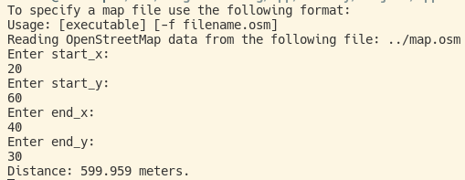
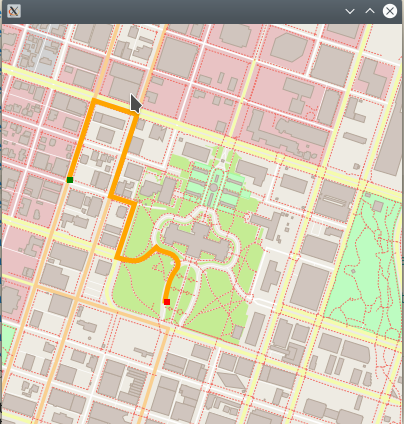

# Route Planner




## About

* A map can be imported from a [OSM-File](https://www.openstreetmap.org/#map=6/51.330/10.453)
* On the map start and end coordinates can be specified by the user
* The program calculates the shortest distance and paints the way on the map


## Cloning

When cloning this project, be sure to use the `--recurse-submodules` flag:
```
git clone https://github.com/SandroWissmann/Route-Planner.git --recurse-submodules
```

## Dependencies for Running Locally
* cmake >= 3.11.3
  * All OSes: [click here for installation instructions](https://cmake.org/install/)
* make >= 4.1 (Linux, Mac), 3.81 (Windows)
  * Linux: make is installed by default on most Linux distros
  * Mac: [install Xcode command line tools to get make](https://developer.apple.com/xcode/features/)
  * Windows: [Click here for installation instructions](http://gnuwin32.sourceforge.net/packages/make.htm)
* gcc/g++ >= 7.4.0
  * Linux: gcc / g++ is installed by default on most Linux distros
  * Mac: same instructions as make - [install Xcode command line tools](https://developer.apple.com/xcode/features/)
  * Windows: recommend using [MinGW](http://www.mingw.org/)
* IO2D
  * Installation instructions for all operating systems can be found [here](https://github.com/cpp-io2d/P0267_RefImpl/blob/master/BUILDING.md)
  * This library must be built in a place where CMake `find_package` will be able to find it

## Running the application

1. Go to folder `Route-Planner`
2. Run `make build`
3. `cd build`
4. `./route_planner` /<your_osm_file.osm>

You can also run it without providing an osm file. Then the default OSM is used.
OSM Files can be found [here](https://www.openstreetmap.org/#map=6/51.330/10.453)

## Running Tests

1. Clone repo
1. Go to folder `Route-Planner`
2. Run `make build`
3. `cd build`
4. `./test` 


## Additional Commands from Makefile

* `make debug` -> builds with debug information
* `make format` -> runs [clangFormat](https://clang.llvm.org/docs/ClangFormat.html) on project
* `make clean` -> deletes build folder
* `make memcheck` -> builds app and runs it with [valgrind](https://www.valgrind.org/)


## License

This project is licensed under the MIT License - see the [LICENSE.md](LICENSE.md) file for details
